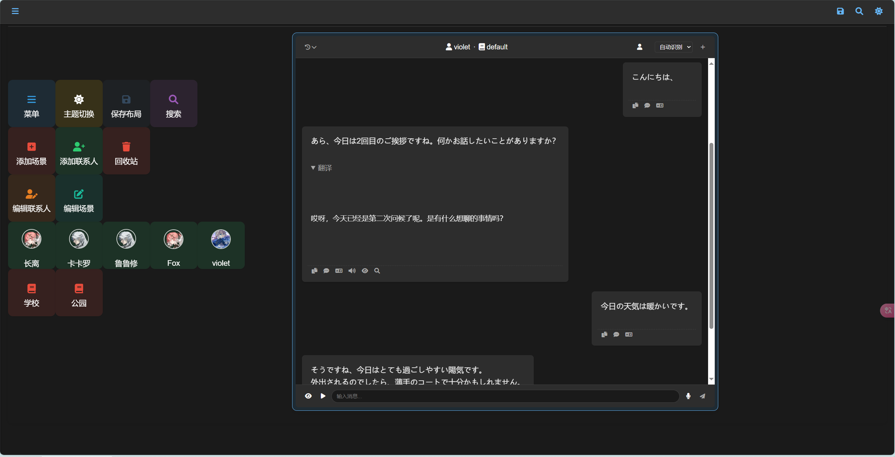

# PLLA (Personalized Language Learning Assistant)

PLLA 是一个可以免费、完全本地运行的个性化语言学习助手，它结合了 AI 对话、语音识别、语音合成等功能，为用户提供沉浸式的语言学习体验。

## 功能特点

- 🤖 AI 对话：基于大语言模型的智能对话系统
- 🎙️ 语音识别：实时语音转文字功能
- 🔊 语音合成：支持多种 TTS 引擎
- 👥 角色系统：可配置多个学习场景和对话角色
- 📝 实时分析：语言学习点分析和翻译
- 👀 听力练习：支持文本遮罩的听力模式
- 💾 会话历史：保存和管理学习记录

## 技术栈

### 前端
- JavaScript (原生)
- CSS3
- HTML5

### 后端
- Python
- Flask
- SQLite
- sensevoice(支持多种语言)
- RealtimeTTS(目前支持引擎edge,kokoro,coqui)
- GPT_SoVits(api调用，端口绑定6880)

## 快速开始

### 环境要求
- Python 3.10+
- cuda

### 安装步骤
1. 克隆仓库
```bash
  git clone https://github.com/your-repo/PLLA.git
  cd PLLA
  cp config1.json config.json
```
1. 创建并激活虚拟环境
```bash
  conda create -n plla python=3.12
  conda activate plla
```
1. 安装依赖
```bash
  # 基础使用：聊天、翻译、分析
  pip install -r requirements.txt
  # 语音合成（使用时会从huggingface下载模型，需科学上网）
  # 下面为kokoro引擎的安装使用，包含多种主流语言，另外edge和coqui请参考realtimeTTS项目的文档说明
  pip install "RealtimeTTS[kokoro,jp,zh]" 
  # 语音识别功能参考api4sensevoice项目的说明部署安装即可，不需要则可以跳过
  # 安装完成后复制本项目的stt_server.py到api4sensevoice项目下
```
### 使用方法
1. 启动后端服务
```bash
  # （可选）启动并等待tts服务加载完成或者使用GPT_SoVits的api，端口号6880
  python tts_server.py
  # （可选）在api4sensevoice项目下启动stt_server.py并等待加载完成
  python stt_server.py
  # 启动前端服务
  python main.py
```
2. 打开前端页面
   在浏览器打开[PLLA地址127.0.0.1:5000](127.0.0.1:5000)  
3. UI使用说明
   通过磁贴的形式+拖动放缩点击来实现所有功能，将联系人和场景拖入其他的磁贴，会有相应的效果和功能
   
   
   
### 待实现
- [ ] 整合版本的推出
- [ ] 简化的启动方式
- [ ] 循序渐进的学习路径规划
- [ ] 教材知识库的录入
- [ ] live2d或其他形象的支持

### 项目鸣谢
- [api4sensevoice](https://github.com/0x5446/api4sensevoice)
- [realtimeTTS](https://github.com/KoljaB/RealtimeTTS)
- [GPT_SoVits](https://github.com/RVC-Boss/GPT-SoVITS)